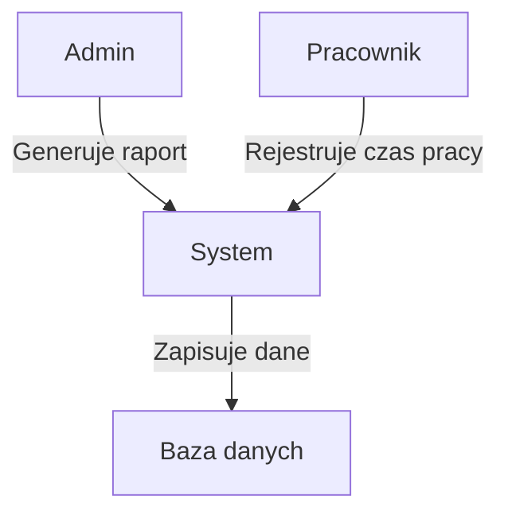
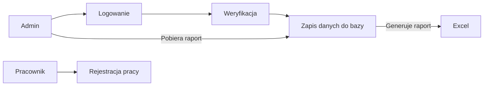
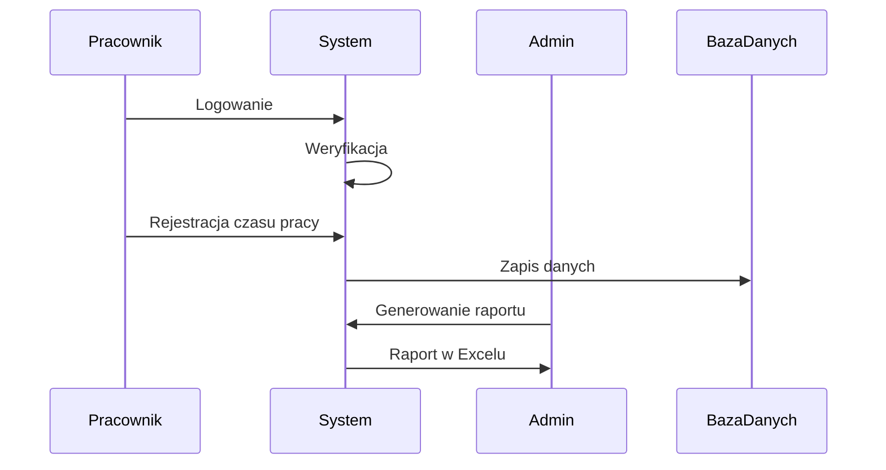

# Dokumentacja projektu: Aplikacja do śledzenia czasu pracy

## Członkowie zespołu:
- **Aleksandra Adamiak**
- **Maja Chlipała**
- **Paweł Klocek**
- **Kamil Hebda**

---

## 1. Macierz kompetencji zespołu

| Kompetencje             | Ola | Maja | Paweł | Kamil |
|-------------------------|-----|------|-------|-------|
| Znajomość algorytmów     | TAK | TAK  | TAK   | TAK   |
| Znajomość Excela         | TAK | TAK  | NIE   | TAK   |
| Znajomość j. angielskiego| TAK | TAK  | TAK   | TAK   |
| Obsługa GitLab           | TAK | TAK  | TAK   | TAK   |
| Programowanie Python     | TAK | TAK  | TAK   | TAK   |
| Programowanie SQL        | TAK | TAK  | TAK   | TAK   |
| Programowanie C++        | TAK | TAK  | NIE   | NIE   |
| Programowanie Java       | NIE | NIE  | TAK   | TAK   |
| Programowanie Matlab     | NIE | TAK  | NIE   | NIE   |
| Praca w grupie           | TAK | NIE  | TAK   | TAK   |
| Testowanie oprogramowania| TAK | TAK  | TAK   | NIE   |

---

## 2. Pytania i odpowiedzi związane z projektem

| Pytanie                                | Odpowiedź                                               | Uwagi                          |
|----------------------------------------|---------------------------------------------------------|--------------------------------|
| W jakim terminie należy oddać aplikację?| 6 listopada 2024 (środa)                                |                                |
| Jak mają być generowane raporty?       | W ciągu 1 sekundy                                       |                                |
| W jakiej formie ma być aplikacja?      | Aplikacja webowa                                        |                                |
| Jak ma się logować admin?              | Za pomocą ID admina i hasła, ID opisane jako „admin”     | ID w bazie danych               |
| Jak przeprowadzana jest weryfikacja?   | Za pomocą ID pracownika, numeru stanowiska i hasła       |                                |
| Zarządzanie bazą pracowników           | Admin zarządza danymi, dodaje/usuwa pracowników i hasła  |                                |
| Jak generowany jest raport?            | Raport generowany w Excelu, zawiera historię czasu pracy | Zawiera ID pracownika i numer stanowiska |
| Czy wszystkie wymagania są spełnione?  | TAK                                                     |                                |

---

## 3. Ustalony format danych wejściowych

| ID | Numer stanowiska | Hasło/Token | Zdjęcie |
|----|------------------|-------------|---------|
| int (unique) | numer stanowiska | Generowane przez admina, wpisywane przez pracownika | .png |

---

## 4. Opis modelowanego systemu

|                              |                                                                                                                                                             |
|------------------------------|-------------------------------------------------------------------------------------------------------------------------------------------------------------|
| **Aktorzy**                  | Admin, pracownicy                                                                                                                                           |
| **Opis**                     | Celem działania jest pełen wgląd w czas pracy pracowników firmy w celu dokładniejszej kontroli ich wydajności w ramach kwartalnej/miesięcznej ewaluacji.    |
| **Dane**                     | Czas rozpoczęcia i zakończenia pracy w danym dniu.                                                                                                          |
| **Wyzwalacz**                | Admin – przycisk „wygeneruj raport”.                                                                                                                         |
| **Odpowiedź**                | Raport: prezentacja czasu pracy pracownika w Excel.                                                                                                          |
| **Uwagi**                    | Czas pracy nie powinien przekraczać maksymalnie 12 godzin danego dnia.                                                                                       |

---

## 5. Diagramy UML:

### Diagram przypadków użycia 

### Diagram przepływu danych

### Diagram sekwencyjny UML

## 6. Architektura systemu:
System składa się z trzech głównych komponentów:

- **Logowanie i weryfikacja użytkownika** – system umożliwia poprawną autoryzację pracowników.
- **Baza danych** – gromadzi i segreguje informacje o czasie pracy.
- **Generowanie raportów** – admin może wygenerować raport na podstawie danych z bazy.

## 7. Język implementacji: python 

Uzasadnienie: wszyscy członkowie zespołu podali w kompetencjach umiejętność programowania w pythonie, zatem jest to opcja najwygodniejsza do wprowadzenia – cały zespół będzie mógł współpracować na równym poziomie. Dodatkowo za pythonem przemawia doświadczenie w tworzeniu stron internetowych po semestralnym kursie, w którym uczestniczył każdy z członków zespołu. 
